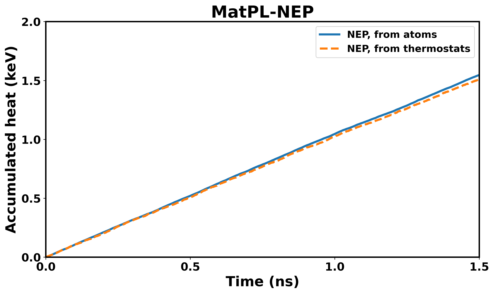

# Heat Flux Example

This example calculates the thermal conductivity of graphene using the MatPL-NEP potential in LAMMPS, based on the non-equilibrium molecular dynamics (NEMD) method.

## Files

| File | Description |
|------|-------------|
| `graphene.in` | LAMMPS input script for heat flux simulation |
| `graphene.data` | Graphene structure data file |
| `nep.txt` | NEP potential file |
| `job.sh` | SLURM job submission script |
| `compute_Energy_Temp.out` | FP64 reference output: energy and temperature from thermostats |
| `compute_HeatFlux.out` | FP64 reference output: heat flux from atomic computations |
| `calc_heatflux.py` | Visualization script, generates `HeatFlux.png` |
| `check_test.py` | Automated test validation script (MIX vs FP64) |

## Method

The simulation applies Langevin thermostats at two ends of the graphene sheet (350 K and 250 K) to establish a temperature gradient. The accumulated heat is computed in two independent ways:

1. **From atoms**: integrating the heat flux computed from atomic stress tensors
2. **From thermostats**: tracking energy added/removed by the hot/cold thermostats

If the two curves agree, the heat flux calculation is validated.

## Running the Simulation

```bash
# Submit via SLURM
sbatch job.sh

# Or run directly (adjust GPU/MPI settings as needed)
mpirun -np 4 lmp -k on g 4 -sf kk -pk kokkos -in graphene.in
```

## Validating Results

The test validates MIX-precision results against the FP64 reference. Only `compute_HeatFlux.out` is compared — `compute_Energy_Temp.out` is expected to have some deviation under MIX precision and is not checked.

After the MIX-precision simulation finishes, run:

```bash
python check_test.py <test_dir> [ref_dir]
```

- `test_dir`: directory containing the MIX-precision `compute_HeatFlux.out`
- `ref_dir`: directory containing the FP64 reference (default: current directory)

Example:

```bash
# Compare MIX results in ./mix_run against FP64 reference in current dir
python check_test.py ./mix_run .
```

The script reports PASS/FAIL based on:
- Relative max error of accumulated heat flux < 5%
- R-squared > 0.99

To generate the comparison plot:

```bash
python calc_heatflux.py <path>
```

This produces `HeatFlux.png` showing both the atom-derived and thermostat-derived curves overlaid.

## Expected Output

A successful test shows that the MIX-precision accumulated heat flux curve closely matches the FP64 reference, confirming numerical consistency of the MatPL-NEP potential under mixed precision.


